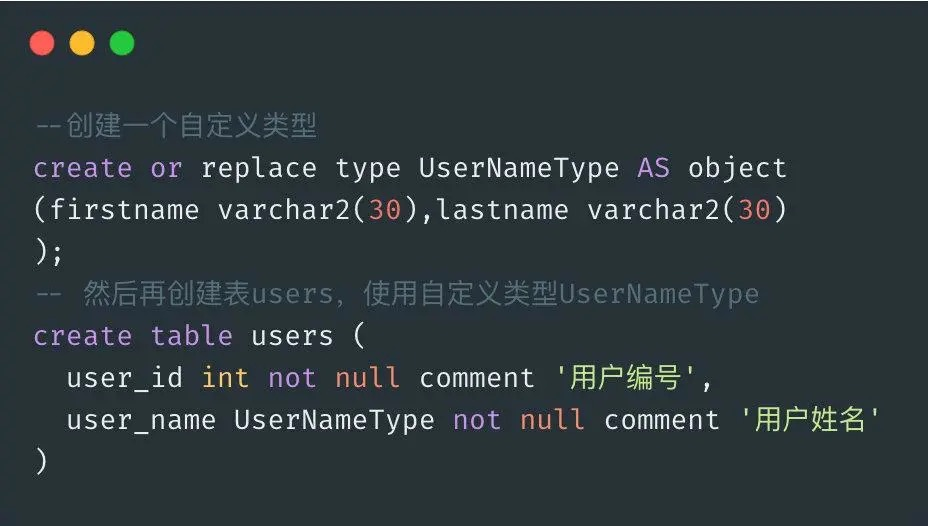

# 数据库设计三范式

## 第一范式 1NF
  - 确保每个字段保持原子性，不可分割。
  >对于用户表 users 来说，有用户姓名（一般由 first_name 和 last_name 组成），如果使用类似 Oracle 的复合数据类型，就违反了 1NF。很明显 users 的字段 user_name 是一个自定类型，是可分解的，这就违反了 1NF。
  
  > 

## 第二范式 2NF
  - 确保字段`完全依赖`于主键。（主要针对联合主键而言）
  > 一个表中只能保存一种数据，不可以把多种数据保存在一张表里，假如一张表既存储了用户信息，又存储商品信息，还存储了订单信息，这样就违反了 2NF，而应该将用户表，商品表，订单表拆分成三张表，确保字段是该表拥有的。

## 第三范式 3NF
  - 必须满足 2NF，实体中每个属性与主键直接相关而不能间接相关。
  > 这个也不难理解，对于订单表 orders 来讲，是要存储用户表 users 的 user_id，要明确哪个用户下的单，有些业务场景是要获取 users 表的用户姓名 user_name，为了减少 orders 和 users 表的关联查询，将 user_name 冗余到 orders 表中，这种设计就违反了 3NF，减少数据冗余，可以通过主外键进行表之间连接。