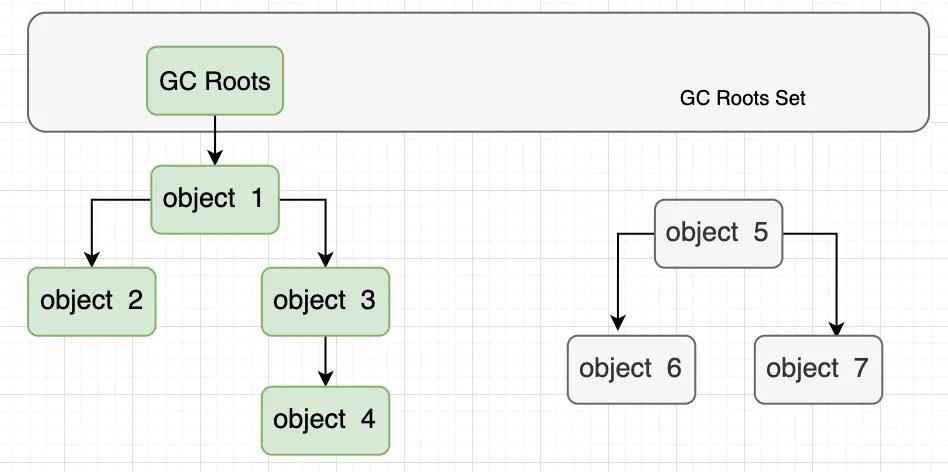

# 一、Jvm的内存区域

## 线程私有的内存区域

- 程序计数器：可看做当前线程执行字节码的行号指示器，字节码解释器工作时通过改变计数器的值来选择下一条所需执行的字节码指令

- 虚拟机栈：Java方法执行的栈帧，用于存储局部变量表、操作数栈、动态链接、方法出口等信息。每个方法从调用至执行完成的过程，都对应一个栈帧在虚拟机栈的入栈到出栈的过程
  
  - 局部变量表：存放编译期可知的基本数据类型（boolean、byte、char、int等）、对象引用（reference类型）和 returnAddress类型（指向一条字节码指令的地址）

- 本地方法栈：Native方法执行的栈帧

## 所有线程共享的内存区域

- 堆：存放对象实例和数组
- 方法区：存储被虚拟机加载的Class类信息、final常量、static静态变量、即时编译器编译后的代码等数据
  
  - 运行时常量池：存放编译生成的各种字面量和符号引用，运行期间也可能将新的常量放入池中

# 二、内存溢出异常

除程序计数器外，JVM其他几个运行时区域都可能发生OutOfMemoryError异常。

## 1、堆内存溢出，OutOfMemoryError:java heap space

**原因**：Java堆用于存储对象实例，只要不断创建对象，并保证GC Roots到对象间有可达路径避免这些对象的GC，当对象数量达到堆的最大容量限制后就会产生OOM

​    **解决方法**：

- 通过参数 -XX:HeapDumpOnOutOfMemoryError 可以让虚拟机在内存溢出异常时Dump当前内存堆转储快照
- 通过内存映像分析工具（如：Eclipse Memory Analyzer）对Dump出的堆转储快照分析，判断是内存泄露还是内存溢出
- 如果是内存泄露：通过工具查看泄露对象的类型信息和它们到 GC Roots 的引用链信息，分析GC收集器无法自动回收它们的原因，定位内存泄露的代码位置
- 如果是内存溢出：检查堆参数 -Xms和-Xmx，看是否可调大；代码上检查某些对象生命周期过长，持有时间过长的情况，尝试减少程序运行期间内存消耗

## 2、栈内存溢出，StackOverflowError

**原因**：

- StackOverFlowError异常：线程请求的栈深度大于虚拟机所允许的最大深度
- OutOfMemoryError异常：虚拟机扩展栈时无法申请足够的内存空间

​    **解决方法**：

- 检查代码中是否有死递归；配置 -Xss 增大每个线程的栈内存容量，但会减少工作线程数，需要权衡

# 三、垃圾回收策略

## 1、对象存活判断

判断对象是否存活：堆中存放着几乎所有的对象实例，GC收集器在对堆进行回收前，首先要确定哪些对象是“存活”的，哪些是“死去”的

### (1)引用计数法

给每个对象添加一个引用计数器，每当有地方引用他时，计时器 +1；引用失效时，计数器 -1。当计数器为0时，对象就不再被引用。

但主流Java虚拟机没有采用这种算法，主要原因是：**它难以解决对象之间循环引用的问题**

### (2)可达性分析算法

通过一系列称为“GC Roots”的对象作为起始点，从这些节点向下搜索，搜索的路径称为引用链。当一个对象到 GC Roots 没有任何引用链相连（即从 GC Roots 到该对象不可达），则此对象是不可用的，会判断为可回收对象。

绿色部分的对象都在GC Roots的引用链上，就不会被垃圾回收器回收，灰色部分的对象没有在引用链上，自然就被判定为可回收对象。

可以作为GC Roots的对象：

- Java虚拟机栈中被引用的对象，各个线程调用的参数、局部变量、临时变量等。
- 方法区中类静态属性引用的对象，比如引用类型的静态变量。
- 方法区中常量引用的对象。
- 本地方法栈中所引用的对象。
- Java虚拟机内部的引用，基本数据类型对应的Class对象，一些常驻的异常对象。
- 被同步锁（synchronized）持有的对象。

## 2、垃圾回收区域

### 堆内存（主要回收区域）

垃圾回收主要是回收 **堆内存**。在堆中，新生代常规应用进行一次GC一般可回收 70%~95% 的空间，永久代的 GC效率远低于此

### 方法区

**方法区** 进行垃圾回收的“性价比”一般比较低，主要回收两部分内容：废弃常量和无用的类

- 废弃常量回收：假如常量池的字符串，例如：“abc”，当前系统没有任何一个String对象引用这个字面量，则“abc”常量会被清理出常量池。常量池中的其他类、方法、字段的符号引用与此类似
- 无用的类回收：类需要满足下面3个条件才算是“无用的类”
  - 该类的堆中所有实例都被回收
  - 加载该类的 Class Loader 已被回收
  - 该类对应的 java.lang.Class 对象没有在任何地方被引用，无法在任何地方反射访问该类的方法

### 堆外内存

**堆外内存**是把内存对象分配在Java虚拟机的堆以外的内存，包括JVM自身运行过程中分配的内存，JNI 里分配的内存、java.nio.DirectByteBuffer 分配的内存等，这些内存直接受操作系统管理。这样能一定程度的减少GC对应用程序的影响。但 JVM 不直接管理这些堆外内存，存在 OOM 的风险，可以在 JVM 启动参数加上 -XX:MaxDirectMemorySize，对申请的堆外内存大小进行限制

DirectByteBuffer 对象表示堆外内存，DirectByteBuffer 对象中持有 Cleaner 对象，它唯一保存了堆外内存的数据、开始地址、大小和容量。在创建完后的下一次 Full GC 时， Cleaner对象会对堆外内存回收

## 3、垃圾回收算法

### (1)标记-清除算法

标记-清除算法分为“标记”阶段和“清除”阶段。

- 标记阶段是把所有活动对象都做上标记。
- 清除阶段是把那些没有标记的对象（非活动对象）回收

它主要有两个不足：

- 效率问题：标记和清除两个过程的效率都不高
- 空间问题：标记清除之后会有大量不连续的内存碎片。空间碎片过多可能导致后续需要分配大对象时，无法找到足够的连续内存而不得不提前触发另一次 GC

### (2)复制算法

复制算法是将可用内存划分为大小相等的两块，每次只使用一块，当一块内存用完了，就将存活的对象复制到另一块上，然后将已使用的内存空间一次清理掉。

这样分配内存时不用考虑内存碎片等复杂情况，但代价是将内存缩小为原来的一半。当对象存活率较高时，就要较多的复制操作，效率也会降低。

>现在的商业虚拟机都**采用复制算法来回收新生代**。IBM专门的研究表明：**新生代中对象 `98%` 是“朝生夕死”的**，所有不需要 1:1 来划分空间，HotSpot虚拟机是将内存分为1块大的 Eden 和 2块小的 Survivor 空间，大小比例为 `8:1:1`。每次使用 Eden 和 其中一块 Survivor。当回收时，将 Eden 和 一块 Survivor 中的存活对象复制到另一块 Survivor 上，最后清理掉刚才的 Eden 和 Survivor。新生代每次可利用的整个新生态内存的 90%，10% 会被浪费掉。但当每次回收多余 10% 对象存活时，即剩下一个 Survivor 空间不够时，需要老年代**内存担保**，这些对象将直接进入老年代中。 

### (3)标记-整理算法

标记-整理算法在“标记”阶段和标记-清除一样，但后续是让所有存活对象都向一端移动，然后清理掉端边界外的内存

### (4)分代算法

根据对象存活周期的不同将内存划分为几块看，一般把堆分为“年轻代”和“老年代”，根据各个年代的特点采用适当的收集算法。

**新生态中，每次 GC 只有少量的对象存活，就选用复制算法**，只需要付出少量存活对象的复制成本就可以完成收集

**老年代中，对象存活率高、没有额外的担保空间，就必须使用“标记-清除”或“标记-整理”算法**

Java堆的具体划分；两个分代收集理论：

- 弱分代假说：大多数对象的生命存活时间很短。
- 强分代假说：经过越多次垃圾收集的对象，存活的时间就越久。

GC的分类：

- **Minor GC/Young GC**：针对新生代的垃圾收集。
- **Major GC/Old GC**：针对老年代的垃圾收集。
- **Full GC**：针对整个Java堆以及方法区的垃圾收集。

GC的流程：

通常情况下，初次被创建的对象存放在新生代的**Eden区**，当第一次触发**Minor GC**，Eden区存活的对象被转移到**Survivor区**的某一块区域。以后再次触发**Minor GC**的时候，Eden区的对象连同一块Survivor区的对象一起，被转移到了另一块Survivor区。可以看到，这两块Survivor区我们每一次只使用其中的一块，这样也仅仅是浪费了一块Survivor区。

每经历过一次垃圾回收的对象，它的分代年龄就加1，当分代年龄达到15以后，就直接被存放到老年代中。

还有一种情况，给大对象分配内存的时候，Eden区已经没有足够的内存空间了，这时候该怎么办？对于这种情况，**大对象就会直接进入老年代**。

## 4、垃圾收集器

- **G1收集器(支持收集新生代和老年代) - jdk1.7**

  - `并行和并发`。使用多个 CPU 来缩短 Stop The World 停顿时间，与用户线程并发。
  - `分代收集`。独立管理整个堆，但是能够采用不同的方式去处理新创建对象和已经存活了一段时间、熬过多次GC的旧对象，以获取更好的收集效果。
  - `空间整合`。基于标记-整理算法，无内存碎片产生。
  - `可预测的停顿`。能建立和预测的停顿时间模型，能让使用者明确指定在一个长度为 M 毫秒的时间片段内，消耗在垃圾收集上的时间不得超过 N 毫秒。

- **Young Generation**

  - Serial 收集器（jdk1.3）。采用复制算法的单线程收集器
  - ParNew 收集器 （jdk1.4）。其实就是 Serial 收集器的多线程版本
  - Parallel Scavenge 收集器（jdk1.4）。一个新生代收集器，复制算法，也是并行多线程收集器；也是虚拟机运行在 Server 模式下的默认垃圾收集器；目标是达到一个可控的吞吐量。

- **Tenured Generation**

  - Parallel Old 收集器（jdk1.6）。Parallel Scavenge 收集器的老年代版本，使用`多线程`和`标记-整理`算法。
  - CMS 收集器（jdk1.5）。Concurrent Mark Sweep 收集器，获取最短回收停顿时间为目标，使用`标记-清除`算法。
  - Serial Old 收集器（jdk1.5）。Serial 收集器的老年代版本，使用`单线程`和`标记-整理`算法。

### JVM 参数

| 参数                            | 描述                                                         |
| ------------------------------- | ------------------------------------------------------------ |
| -Xms                            | 初始堆大小。如：-Xms256m                                     |
| -Xmx                            | 最大堆大小。如：-Xmx512m                                     |
| -Xmn                            | 新生代大小。通常为 Xmx 的 1/3 或 1/4。新生代 = Eden + 2 个 Survivor 空间。实际可用空间为 = Eden + 1 个 Survivor，即 90% |
| -Xss                            | JDK1.5+ 每个线程堆栈大小为 1M，一般来说如果栈不是很深的话， 1M 是绝对够用了的。 |
| -XX:NewRatio                    | 新生代与老年代的比例，如 –XX:NewRatio=2，则新生代占整个堆空间的1/3，老年代占2/3 |
| -XX:SurvivorRatio               | 新生代中 Eden 与 Survivor 的比值。默认值为 8。即 Eden 占新生代空间的 8/10，另外两个 Survivor 各占 1/10 |
| -XX:PermSize                    | 持久代(方法区)的初始大小                                     |
| -XX:MaxPermSize                 | 持久代(方法区)的最大值                                       |
| -XX:+PrintGCDetails             | 打印 GC 信息                                                 |
| -XX:+HeapDumpOnOutOfMemoryError | 让虚拟机在发生内存溢出时 Dump 出当前的内存堆转储快照，以便分析用 |