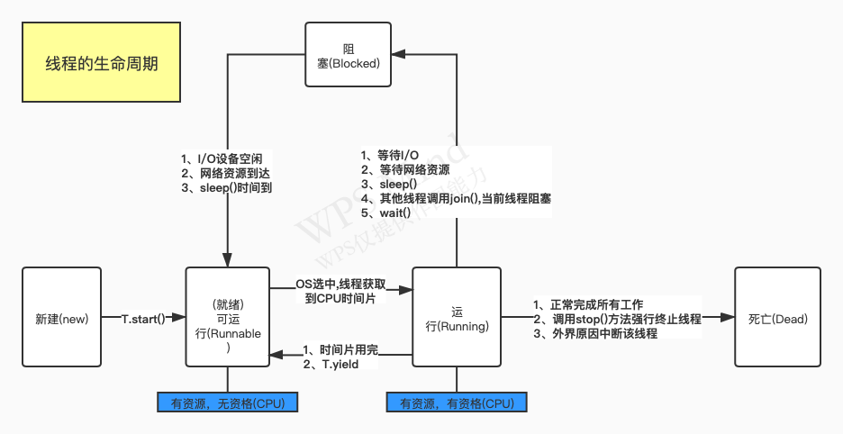

# Java线程
## 1、线程的创建方式

- 集成Thread类

```java
package com.example.learning.thread;

import lombok.extern.slf4j.Slf4j;

/**
 * @author solin.jiang
 * @Description
 * @create 2020-11-24 16:25
 *
 * java 线程的实现和创建方式
 *
 * Java线程的创建方式：
 *  1、继承Thread类(Thread的本质也是实现了Runnable接口)
 *  2、实现Runnable接口
 *  3、实现Callable接口,
 *
 *  start()方法启动一个线程
 *  run()方法仅仅是类中的一个方法
 *  
 *  通过集成Thread类创建线程
 */
@Slf4j
public class MyThread extends Thread {

    @Override
    public void run() {
        Thread thread = Thread.currentThread();
        log.info("this is myThread...Name：{}", thread.getName());
    }

    public static void main(String[] args) throws InterruptedException{
        Thread thread = Thread.currentThread();

        MyThread myThread = new MyThread();
        myThread.start();
//        myThread.run();
        log.info("this is main...Name：{}",thread.getName());
    }
}
```

- 实现Runnable接口

```java
package com.example.learning.thread;

import lombok.extern.slf4j.Slf4j;

/**
 * @author solin.jiang
 * @Description
 * @create 2020-11-24 17:50
 * 通过实现Runnable接口创建线程
 */
@Slf4j
public class MyThread2 implements Runnable {
    @Override
    public void run() {
        Thread thread = Thread.currentThread();
        log.info("MyThread2 implements Runnable...Name:{}",thread.getName());
    }

    public static void main(String[] args) {
        MyThread2 myThread2 = new MyThread2();
        Thread thread1 = new Thread(myThread2);
        thread1.start();
        Thread thread = Thread.currentThread();
        log.info("this is main...Name:{}",thread.getName());

    }
}
```

- 实现Callable接口

```java
package com.example.learning.thread;

import lombok.extern.slf4j.Slf4j;
import java.util.concurrent.Callable;
import java.util.concurrent.ExecutionException;
import java.util.concurrent.FutureTask;

/**
 * @author solin.jiang
 * @Description
 * @create 2020-11-24 17:58
 *
 * 从继承Thread类和实现Runnable接口可以看出，上述两种方法都不能有返回值，且不能声明抛出异常。
 * 而Callable接口则实现了此两点，Callable接口如同Runnable接口的升级版，其提供的call()方法将作为线程的执行体，同时允许有返回值。
 *
 * 但是Callable对象不能直接作为Thread对象的target，因为Callable接口是 Java 5 新增的接口，不是Runnable接口的子接口。
 * 对于这个问题的解决方案，就引入 Future接口，此接口可以接受call() 的返回值，RunnableFuture接口是Future接口和Runnable接口的子接口，
 * 可以作为Thread对象的target 。并且， Future 接口提供了一个实现类：FutureTask 。
 *
 * FutureTask实现了RunnableFuture接口，可以作为 Thread对象的target。
 */
@Slf4j
public class MyThread3{
    public static void main(String[] args) {
        FutureTask<Integer> task = new FutureTask<Integer>((Callable<Integer>)()->{
            int i = 0 ;
            for(;i<100;i++){
                log.info("{}的循环变量i的值:{}",Thread.currentThread().getName(),i);
            }
            return i;
        });

        for(int i=0;i<100;i++){
//            log.info("{}的循环变量i:{}",Thread.currentThread().getName(),i);
            if(i==20){
                new Thread(task,"有返回值的线程").start();
            }
        }
        try {
            log.info("返回值：{}",task.get());
        } catch (InterruptedException e) {
            e.printStackTrace();
        } catch (ExecutionException e) {
            e.printStackTrace();
        }

    }
}
```

## 线程池

```Java
package com.example.learning.thread;

import lombok.extern.slf4j.Slf4j;
import java.util.concurrent.ExecutorService;
import java.util.concurrent.Executors;

/**
 * @author solin.jiang
 * @Description
 * @create 2020-11-25 09:43
 *
 * newFixedThreadPool，newCachedThreadPool只是把ThreadPoolExecutor进行了封装而已，
 * 所以建议直接使用ThreadPoolExecutor而不是这些封装类
 *
 */
@Slf4j
public class MyThreadPool {
    public static void main(String[] args) {
        ExecutorService executorService = Executors.newFixedThreadPool(10);
        while (true){
            executorService.execute(new Runnable() {
                @Override
                public void run() {
                    log.info("当前线程的名称：{}",Thread.currentThread().getName());
                    try {
                        Thread.sleep(3000);
                    } catch (InterruptedException e) {
                        e.printStackTrace();
                    }
                }
            });
        }
    }
}
```

- 使用阿里推荐的方式：ThreadPoolExecutor 创建线程池
> 【强制】线程池不允许使用 Executors 去创建，而是通过 ThreadPoolExecutor 的方式，这样
  的处理方式让写的同学更加明确线程池的运行规则，规避资源耗尽的风险。
  说明：Executors 返回的线程池对象的弊端如下： 1）FixedThreadPool 和 SingleThreadPool:
  允许的请求队列长度为 Integer.MAX_VALUE，可能会堆积大量的请求，从而导致 OOM。 2）CachedThreadPool 和 ScheduledThreadPool:
  允许的创建线程数量为 Integer.MAX_VALUE，可能会创建大量的线程，从而导致 OOM。

```java
package com.example.learning.thread;

import com.google.common.util.concurrent.ThreadFactoryBuilder;
import lombok.extern.slf4j.Slf4j;

import java.util.concurrent.*;

/**
 * @author solin.jiang
 * @Description
 * @create 2020-11-25 10:00
 *
 * 使用 ThreadPoolExecutor 创建线程池
 *
 * ThreadPoolExecutor的7个参数：
 * 1、corePoolSize：核心线程数
 *    核心线程会一直存活，及时没有任务需要执行
 *    当线程数小于核心线程数时，即使有线程空闲，线程池也会优先创建新线程处理
 *    设置allowCoreThreadTimeout=true（默认false）时，核心线程会超时关闭
 * 2、maximumPoolSize:最大线程数
 *    当线程数>=corePoolSize，且任务队列已满时。线程池会创建新线程来处理任务
 *    当线程数=maxPoolSize，且任务队列已满时，线程池会拒绝处理任务而抛出异常
 * 3、keepAliveTime:线程空闲时间
 *    当线程空闲时间达到keepAliveTime时，线程会退出，直到线程数量=corePoolSize
 *    如果allowCoreThreadTimeout=true，则会直到线程数量=0
 * 4、unit:时间单位
 *    空闲线程存活时间的单位，如TimeUnit.SECONDS、TimeUnit.MILLISECONDS等。
 * 5、workQueue:任务队列
 *    工作队列（阻塞队列），简单来说，队列的容量决定了能有多少请求被阻塞队列接受。线程池达到最大线程数在处理请求，接下来的请求就会被放入阻塞队列等待处理。
 * 6、threadFactory:
 *    线程工厂，一般使用默认Executors.defaultThreadFactory()即可。
 * 7、handler:线程池的拒绝策略
 *    当等待队列已经满了，再也塞不下新的任务，同时，线程池也达到max线程了，无法为新任务服务，
 *    这时，我们需要拒绝策略机制合理的处理这个问题。TODO(了解拒绝策略机制) 
 */
@Slf4j
public class MyThreadPool2 {

    public static void main(String[] args) {
        ThreadFactory namedThreadFactory = new ThreadFactoryBuilder()
                .setNameFormat("demo-pool-%d").build();
        ThreadPoolExecutor threadPoolExecutor = new ThreadPoolExecutor(10,15,5000,
                TimeUnit.MILLISECONDS,new LinkedBlockingDeque<>(), namedThreadFactory);

        threadPoolExecutor.execute(new Runnable() {
            @Override
            public void run() {
                log.info("当前线程的名称：{}",Thread.currentThread().getName());
            }
        });
    }
}
```

# 线程的生命周期


# 线程终止的4种方式
- 程序运行结束,线程自动结束
- 使用退出标志,退出线程
  > 一般 run()方法执行完，线程就会正常结束，然而，常常有些线程是伺服线程。它们需要长时间的
   运行，只有在外部某些条件满足的情况下，才能关闭这些线程。使用一个变量来控制循环，例如：
   最直接的方法就是设一个 boolean 类型的标志，并通过设置这个标志为 true 或 false 来控制 while
   循环是否退出，代码示例：
