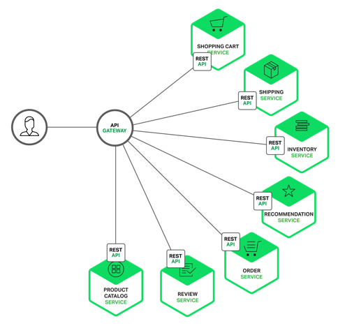

# API Gateway

- API Gateway是微服务架构中不可或缺的部分。API Gateway的定义以及存在的意义，Chris已经为大家描述过了，本文不再赘述，以下是链接：

- 使用API Gateway后，客户端和微服务之间的网络图变成下图：

- 通过API Gateway，可以统一向外部系统提供REST API。Spring Cloud中使用Zuul作为API Gateway。Zuul提供了动态路由、监控、回退、安全等功能。