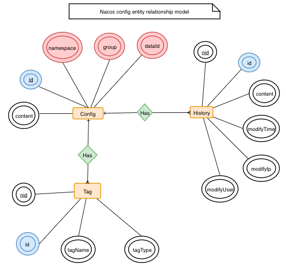

# Nacos 配置与管理微服务
> [参考-Nacos文档](https://nacos.io/zh-cn/docs/what-is-nacos.html)

Nacos 致力于帮助您发现、配置和管理微服务。

Nacos 提供了一组简单易用的特性集，帮助您快速实现动态服务发现、服务配置、服务元数据及流量管理。

## Nacos的关键特性
### 1、服务发现和服务健康监测
- Nacos 支持基于 DNS 和基于 RPC 的服务发现。 服务提供者使用 原生SDK、OpenAPI、或一个独立的Agent TODO注册 Service 后， 服务消费者可以使用DNS TODO 或HTTP&API查找和发现服务
- Nacos 提供对服务的实时的健康检查，阻止向不健康的主机或服务实例发送请求。Nacos 支持传输层 (PING 或 TCP)和应用层 (如 HTTP、MySQL、用户自定义）的健康检查。 对于复杂的云环境和网络拓扑环境中（如 VPC、边缘网络等）服务的健康检查，Nacos 提供了 agent 上报模式和服务端主动检测2种健康检查模式。Nacos 还提供了统一的健康检查仪表盘，帮助您根据健康状态管理服务的可用性及流量。
### 2、动态配置服务
- 动态配置服务可以让您以中心化、外部化和动态化的方式管理所有环境的应用配置和服务配置。 动态配置消除了配置变更时重新部署应用和服务的需要，让配置管理变得更加高效和敏捷。 配置中心化管理让实现无状态服务变得更简单，让服务按需弹性扩展变得更容易。
- Nacos 提供了一个简洁易用的UI (控制台样例 Demo) 帮助您管理所有的服务和应用的配置。Nacos 还提供包括配置版本跟踪、金丝雀发布、一键回滚配置以及客户端配置更新状态跟踪在内的一系列开箱即用的配置管理特性，帮助您更安全地在生产环境中管理配置变更和降低配置变更带来的风险。
### 3、动态配置DNS服务
- 动态 DNS 服务支持权重路由，让您更容易地实现中间层负载均衡、更灵活的路由策略、流量控制以及数据中心内网的简单DNS解析服务。动态DNS服务还能让您更容易地实现以 DNS 协议为基础的服务发现，以帮助您消除耦合到厂商私有服务发现 API 上的风险。
- Nacos 提供了一些简单的 DNS APIs TODO 帮助您管理服务的关联域名和可用的 IP:PORT 列表.
### 4、服务及元数据管理
- Nacos 能让您从微服务平台建设的视角管理数据中心的所有服务及元数据，包括管理服务的描述、生命周期、服务的静态依赖分析、服务的健康状态、服务的流量管理、路由及安全策略、服务的 SLA 以及最首要的 metrics 统计数据。

## Nacos中的概念
### 命名空间-NameSpace
- 用于进行租户粒度的配置隔离。不同的命名空间下，可以存在相同的 Group 或 Data ID 的配置。Namespace 的常用场景之一是不同环境的配置的区分隔离，例如开发测试环境和生产环境的资源（如配置、服务）隔离等。
### 配置管理
- 系统配置的编辑、存储、分发、变更管理、历史版本管理、变更审计等所有与配置相关的活动。
### 配置分组 
- Nacos 中的一组配置集，是组织配置的维度之一。通过一个有意义的字符串（如 Buy 或 Trade ）对配置集进行分组，从而区分 Data ID 相同的配置集。当您在 Nacos 上创建一个配置时，如果未填写配置分组的名称，则配置分组的名称默认采用 DEFAULT_GROUP 。配置分组的常见场景：不同的应用或组件使用了相同的配置类型，如 database_url 配置和 MQ_topic 配置。
### 服务名
- 服务提供的标识，通过该标识可以唯一确定其指代的服务
### 服务发现
- 在计算机网络上，（通常使用服务名）对服务下的实例的地址和元数据进行探测，并以预先定义的接口提供给客户端进行查询。
### 权重
- 实例级别的配置。权重为浮点数。权重越大，分配给该实例的流量越大。
### 健康检查
- 以指定方式检查服务下挂载的实例 (Instance) 的健康度，从而确认该实例 (Instance) 是否能提供服务。根据检查结果，实例 (Instance) 会被判断为健康或不健康。对服务发起解析请求时，不健康的实例 (Instance) 不会返回给客户端。
### 健康保护阈值
- 为了防止因过多实例 (Instance) 不健康导致流量全部流向健康实例 (Instance) ，继而造成流量压力把健康实例 (Instance) 压垮并形成雪崩效应，应将健康保护阈值定义为一个 0 到 1 之间的浮点数。当域名健康实例数 (Instance) 占总服务实例数 (Instance) 的比例小于该值时，无论实例 (Instance) 是否健康，都会将这个实例 (Instance) 返回给客户端。这样做虽然损失了一部分流量，但是保证了集群中剩余健康实例 (Instance) 能正常工作。

## Nacos架构
### 基本架构


服务 (Service)
服务是指一个或一组软件功能（例如特定信息的检索或一组操作的执行），其目的是不同的客户端可以为不同的目的重用（例如通过跨进程的网络调用）。Nacos 支持主流的服务生态，如 Kubernetes Service、gRPC|Dubbo RPC Service 或者 Spring Cloud RESTful Service。

服务注册中心 (Service Registry)
服务注册中心，它是服务，其实例及元数据的数据库。服务实例在启动时注册到服务注册表，并在关闭时注销。服务和路由器的客户端查询服务注册表以查找服务的可用实例。服务注册中心可能会调用服务实例的健康检查 API 来验证它是否能够处理请求。

服务元数据 (Service Metadata)
服务元数据是指包括服务端点(endpoints)、服务标签、服务版本号、服务实例权重、路由规则、安全策略等描述服务的数据。

服务提供方 (Service Provider)
是指提供可复用和可调用服务的应用方。

服务消费方 (Service Consumer)
是指会发起对某个服务调用的应用方。

配置 (Configuration)
在系统开发过程中通常会将一些需要变更的参数、变量等从代码中分离出来独立管理，以独立的配置文件的形式存在。目的是让静态的系统工件或者交付物（如 WAR，JAR 包等）更好地和实际的物理运行环境进行适配。配置管理一般包含在系统部署的过程中，由系统管理员或者运维人员完成这个步骤。配置变更是调整系统运行时的行为的有效手段之一。

配置管理 (Configuration Management)
在数据中心中，系统中所有配置的编辑、存储、分发、变更管理、历史版本管理、变更审计等所有与配置相关的活动统称为配置管理。

名字服务 (Naming Service)
提供分布式系统中所有对象(Object)、实体(Entity)的“名字”到关联的元数据之间的映射管理服务，例如 ServiceName -> Endpoints Info, Distributed Lock Name -> Lock Owner/Status Info, DNS Domain Name -> IP List, 服务发现和 DNS 就是名字服务的2大场景。

配置服务 (Configuration Service)
在服务或者应用运行过程中，提供动态配置或者元数据以及配置管理的服务提供者。

### 领域模型
#### 数据模型
Nacos 数据模型 Key 由三元组唯一确定, Namespace默认是空串，公共命名空间（public），分组默认是 DEFAULT_GROUP。

#### 服务领域模型

#### 配置领域模型
围绕配置，主要有两个关联的实体，一个是配置变更历史，一个是服务标签（用于打标分类，方便索引），由 ID 关联。

### 两种交付工件
Nacos 支持标准 Docker 镜像(TODO: 0.2版本开始支持）及 zip(tar.gz)压缩包的构建物。


## Nacos鉴权插件-配置加密插件
TODO 待完善

## Nacos Spring Cloud 快速开始
关于 Nacos Spring Cloud 的详细文档请参看：[Nacos Config](https://github.com/alibaba/spring-cloud-alibaba/wiki/Nacos-config) 和 [Nacos Discovery](https://github.com/alibaba/spring-cloud-alibaba/wiki/Nacos-discovery)

通过 Nacos Server 和 spring-cloud-starter-alibaba-nacos-config 实现配置的动态变更。
通过 Nacos Server 和 spring-cloud-starter-alibaba-nacos-discovery 实现服务的注册与发现。


## Spring cloud Alibaba Nacos 配置中心和服务注册
Nacos （Naming Configuration Service）:Nacos就是注册中心+配置中心的组合 等价于 Eureka + Config + bus。
可以代替Eureka做服务注册中心，可以代替config做配置中心

## 安装Nacos

TODO 安装步骤待完善。。。

## Nacos 服务发现
```
<!--nacos 服务注册核心pom-->
<dependency>
    <groupId>com.alibaba.cloud<groupId>
    <artifactId>spring-cloud-starter-alibaba-nacos-discovery<artifactId>
    <version>${latest.version}</version>
<dependency>
```
## 服务yaml 文件
```yaml
server:
  port: 9001
spring:
  application:
    name: nacos-payment
  cloud:
    nacos:
      discovery:
        server-addr: 127.0.0.1:8848 #nacos服务注册中心地址
management:
  endpoints:
    web:
      exposure:
        include: '*'
```

## 服务启动类
```java
//启动类添加注解 @EnableDiscoveryClient
@SpringBootApplication
@EnableDiscoveryClient
public class Application {
    public static void main(String[] args) {
        SpringApplication.run(NacosPaymentMain9001.class,args);
    }
}
```

## Nacos 启动配置管理
Nacos中配置文件的后缀名需为yaml

${spring.application.name}-${spring.profilr.active}.${spring.cloud.nacos.config.file-extension}

## curl发布和获取服务以及配置
服务注册
```shell
curl -X POST 'http://localhost:8848/nacos/v1/ns/instance?serviceName=tsh.test.crm&ip=192.168.11.12&port=9501'
```

服务发现  
```shell
curl -X GET 'http://localhost:8848/nacos/v1/ns/instance/list?serviceName=tsh.test.crm'
```

发布配置，比如命名空间的ID是3ca49b57-3703-4e32-815d-44dd6d6ddcb5 ，group是crm , dataId是crm , 发布的配置是A=B这种key-value内容
```shell
curl -X POST "http://localhost:8848/nacos/v1/cs/configs?tenant=3ca49b57-3703-4e32-815d-44dd6d6ddcb5&dataId=crm&group=crm&content=A=B"
```

获取配置
```shell
curl -X GET "http://localhost:8848/nacos/v1/cs/configs?dataId=crm&group=crm&tenant=3ca49b57-3703-4e32-815d-44dd6d6ddcb5"
```


