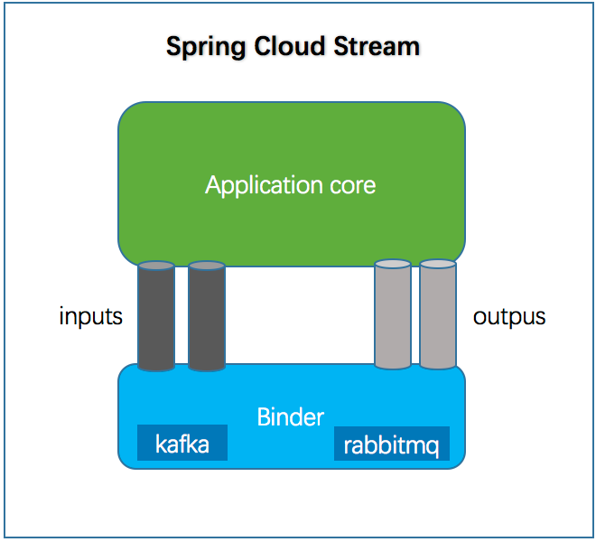

# Spring Cloud Stream 消息驱动微服务框架
## 简介
Spring Cloud Stream 在 Spring Cloud 体系内是一个构建消息驱动微服务的框架，
其目的是为了简化消息在 Spring Cloud 应用程序中的开发。

应用程序通过inputs(消费者)或者outputs(生产者)来与Spring Cloud Stream中binder对象交互。
通过我们配置来绑定，而Spring Cloud Stream的binder对象负责与消息中间件交互。

目前官方的实现有 Rabbit Binder 和 Kafka Binder， Spring Cloud Alibaba 内部已经实现了 RocketMQ Binder。

## 核心概念

### 绑定器
Binder 绑定器是Spring Cloud Stream中一个非常重要的概念。在没有绑定器这个概念的情况下，我们的Spring Boot应用要直接与消息中间件进行信息交互的时候，由于各消息中间件构建的初衷不同，它们的实现细节上会有较大的差异性，这使得我们实现的消息交互逻辑就会非常笨重，因为对具体的中间件实现细节有太重的依赖，当中间件有较大的变动升级、或是更换中间件的时候，我们就需要付出非常大的代价来实施。
通过定义绑定器作为中间层，实现了应用程序与消息中间件(Middleware)细节之间的隔离。通过向应用程序暴露统一的Channel通过，使得应用程序不需要再考虑各种不同的消息中间件的实现。当需要升级消息中间件，或者是更换其他消息中间件产品时，我们需要做的就是更换对应的Binder绑定器而不需要修改任何应用逻辑 。甚至可以任意的改变中间件的类型而不需要修改一行代码。
Spring Cloud Stream支持各种binder实现

通过配置把应用和spring cloud stream 的 binder 绑定在一起，之后我们只需要修改 binder 的配置来达到动态修改topic、exchange、type等一系列信息而不需要修改一行代码。

### 发布/订阅模型
在Spring Cloud Stream中的消息通信方式遵循了发布-订阅模式，当一条消息被投递到消息中间件之 后，它会通过共享的 Topic 主题进行广播，消息消费者在订阅的主题中收到它并触发自身的业务逻辑处
理。这里所提到的 Topic 主题是Spring Cloud Stream中的一个抽象概念，用来代表发布共享消息给消费者的地方。在不同的消息中间件中， Topic 可能对应着不同的概念，比如：在RabbitMQ中的它对应
了Exchange、而在Kakfa中则对应了Kafka中的Topic。

## 相关注解
- @Middleware：中间件，目前只支持RabbitMQ和Kafka
- @Binder：应用层和消息中间件之间的封装，实现了Kafka和RabbitMQ的Binder，通过Binder可以很方便的连接中间件，可以动态的改变消息类型，这些可以通过配置文件修改。
- @Input：表示输入通道，消息进入该通道传到应用程序。
- @Output：注解标识输出通道，发布的消息将通过该通道离开应用程序。
- @StreamListener：监听队列，用于消费者的队列的消息接收。
- @EnableBinding：将信道channel和exchange绑定在一起。



## 示例
### provider 服务提供者
#### 核心POM
```xml
 <dependencies>
        <dependency>
            <groupId>org.springframework.boot</groupId>
            <artifactId>spring-boot-starter-web</artifactId>
        </dependency>
        <dependency>
            <groupId>org.springframework.boot</groupId>
            <artifactId>spring-boot-starter-actuator</artifactId>
        </dependency>
        <dependency>
            <groupId>org.springframework.cloud</groupId>
            <artifactId>spring-cloud-starter-netflix-eureka-client</artifactId>
        </dependency>
        <!-- Spring Cloud Stream - RabbitMq   -->
        <dependency>
            <groupId>org.springframework.cloud</groupId>
            <artifactId>spring-cloud-starter-stream-rabbit</artifactId>
        </dependency>
    </dependencies>
```
#### application.yml
```yaml
server:
  port: 8801

spring:
  application:
    name: cloud-stream-provider
  cloud:
    stream:
      binders: # 在此处配置要绑定的rabbitmq的服务信息；
        defaultRabbit: # 表示定义的名称，用于于binding整合
          type: rabbit # 消息组件类型
          environment: # 设置rabbitmq的相关的环境配置
            spring:
              rabbitmq:
                host: IP #rabbitmq服务启动所在机器的IP地址
                port: 5672
                username: XX 
                password: XX
      bindings: # 服务的整合处理
        output: # 这个名字是一个通道的名称
          destination: exchange # 表示要使用的Exchange名称定义
          content-type: application/json # 设置消息类型，本次为json，文本则设置“text/plain”
          binder: defaultRabbit # 设置要绑定的消息服务的具体设置
```

#### 发送数据接口
```java
public interface IMessageProvider {
    String sendMessage();
}
```
#### 发送数据接口实现
```java
@EnableBinding(Source.class) //定义消息的推送管道
public class IMessageProviderImpl implements IMessageProvider
{
    @Resource
    private MessageChannel output; // 消息发送管道

    @Override
    public String sendMessage()
    {
        String serial = UUID.randomUUID().toString();
        output.send(MessageBuilder.withPayload(serial).build());
        return null;
    }
}
```
### consumer 消息消费者

#### POM
和服务提供者一致
#### application.yml
```yaml
server:
  port: 8802

spring:
  application:
    name: cloud-stream-consumer
  cloud:
    stream:
      binders: # 在此处配置要绑定的rabbitmq的服务信息；
        defaultRabbit: # 表示定义的名称，用于于binding整合
          type: rabbit # 消息组件类型
          environment: # 设置rabbitmq的相关的环境配置
            spring:
              rabbitmq:
                host: IP
                port: 5672
                username: XX
                password: XX
      bindings: # 服务的整合处理
        input: # 这个名字是一个通道的名称
          destination: exchange # 表示要使用的Exchange名称定义
          content-type: application/json # 设置消息类型，本次为对象json，如果是文本则设置“text/plain”
          binder: defaultRabbit # 设置要绑定的消息服务的具体设置

```

#### 接收消息
```java
@Component
@EnableBinding(Sink.class)
public class ReceiveMessageService {

    @Value("${server.port}")
    private String serverPort;

    @StreamListener(Sink.INPUT)
    public void  input(Message<String> message){
        System.out.println("message = "+message.getPayload()+"\t"+"serverPort= "+serverPort);
    }
}
```
## 重复消费问题
默认情况下，每个消费者的分组名都是随机的，不同的，对于不同的组会引起重复消费的问题，例如：消息提供者只向消息队列中发送了一个消息，正常情况下，消费者A从队列中拿走之后，消费者B不能再获得相同的消息，但是由于AB是不同的组，所以A和B都会获取相同的消息，这就导致了资源被重复消费。

微服务应用放置到同一个group中，就能够保证消息只会被其中应用消费一次，不同的组是可以消费的，同一个组内会发生竞争关系，只有其中一个可以消费。

同一个应用的不同微服务，只用在配置文件中指定相同的group。

```yaml
server:
  port: 8802

spring:
  application:
    name: cloud-stream-consumer
  cloud:
    stream:
      binders: # 在此处配置要绑定的rabbitmq的服务信息；
        defaultRabbit: # 表示定义的名称，用于于binding整合
          type: rabbit # 消息组件类型
          environment: # 设置rabbitmq的相关的环境配置
            spring:
              rabbitmq:
                host: IP
                port: 5672
                username: XX
                password: XX
      bindings: # 服务的整合处理
        input: # 这个名字是一个通道的名称
          destination: exchange # 表示要使用的Exchange名称定义
          content-type: application/json # 设置消息类型，本次为对象json，如果是文本则设置“text/plain”
          binder: defaultRabbit # 设置要绑定的消息服务的具体设置
          group: defaultGroup
```
## 消息持久化
当两个消费者A和B，A设置了group属性值，B没有设置，这时，消费者全部宕机，但是消息生产者一直向MQ中生产消息，这时候重启A和B两者有什么区别呢？

正因为B没有这时分组，B再次启动后不会再向MQ中取数据，而A启动成功后可以正常消费消息队列中的消息。

因此设置了group的消费者，可以保证消息队列中的消息持久化，group对于消费者来讲很重要，既能避免重复消费，又能在消费者重启后依然可以消费消息队列中未消费的消息
## 自定义消息通道
```java
interface OrderProcessor {
    String INPUT_ORDER = "inputOrder";
    String OUTPUT_ORDER = "outputOrder";
    @Input(INPUT_ORDER)
    SubscribableChannel inputOrder();
    @Output(OUTPUT_ORDER)
    MessageChannel outputOrder();
}
```
使用 @StreamListener 做监听的时候，需要指定 OrderProcessor.INPUT_ORDER
```yaml
spring:
 cloud:
   stream:
     defaultBinder: defaultRabbit
     bindings:
       inputOrder:
         destination: mqTestOrder
       outputOrder:
         destination: mqTestOrder
```


