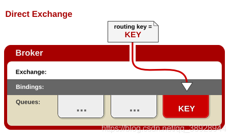
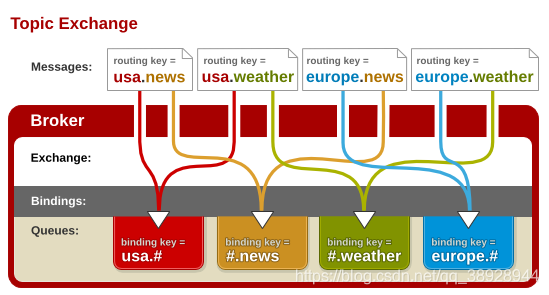
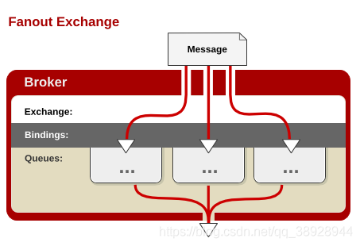

## RabbitMQ几种Exchange

> AMQP协议中的核心思想就是生产者和消费者隔离，生产者从不直接将消息发送给队列。生产者通常不知道是否一个消息会被发送到队列中，只是将消息发送到一个交换机。先由Exchange来接收，然后Exchange按照特定的策略转发到Queue进行存储。同理，消费者也是如此。Exchange 就类似于一个交换机，转发各个消息分发到相应的队列中。

> RabbitMQ提供了四种Exchange模式：fanout,direct,topic,header 。
>
> header模式在实际使用中较少，本文只对前三种模式进行比较。

### 1、Direct

> 所有发送到Direct Exchange的消息被转发到RouteKey中指定的Queue。

> Direct模式,可以使用rabbitMQ自带的Exchange：default Exchange 。所以不需要将Exchange进行任何绑定(binding)操作 。消息传递时，RouteKey必须完全匹配，才会被队列接收，否则该消息会被抛弃。

### 2、Topic

> 所有发送到Topic Exchange的消息被转发到所有关心RouteKey中指定Topic的Queue上。

> Exchange 将RouteKey 和某Topic 进行模糊匹配。此时队列需要绑定一个Topic。可以使用通配符进行模糊匹配，符号“#”匹配一个或多个词，符号“*”匹配不多不少一个词。因此“log.#”能够匹配到“log.info.oa”，但是“log.*” 只会匹配到“log.error”。所以，Topic Exchange 使用非常灵活。

### 3、Fanout

> 所有发送到Fanout Exchange的消息都会被转发到与该Exchange 绑定(Binding)的所有Queue上。

> Fanout Exchange  不需要处理RouteKey 。只需要简单的将队列绑定到exchange 上。这样发送到exchange的消息都会被转发到与该交换机绑定的所有队列上。类似子网广播，每台子网内的主机都获得了一份复制的消息。所以，Fanout Exchange 转发消息是最快的。

