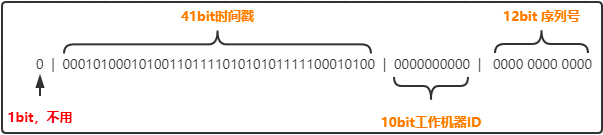

# 雪花算法
雪花算法是Twitter公司发明的一种算法，主要目的是解决在分布式环境下，ID怎样生成的问题
主要是由64bit的long型生成的全局ID,引入了时间戳和ID保持自增的属性

分布式ID生成规则硬性要求
- 全局唯一：不能出现重复的ID号，既然是唯一标识，这是最基本的要求。
- 趋势递增：MySQL中InnoDB引擎使用的是聚集索引。多数RDBMS使用Btree的数据结构来存储索引数据，在主键的选择上尽量选择有序的主键保证写入性能。单调递增：保证下一个ID号一定大于上一个。

分布式ID生成可用性要求：
- 高可用：发布一个获取分布式ID的请求，服务器就要保证99.999%的情况下给创建一个全局唯一的分布式ID。
- 低延迟：发布一个获取分布式ID的请求，要快，急速。
- 高QPS：假如并发一口气10万个创建分布式ID请求同时杀过来，服务器要顶得住并且成功创建10万个分布式ID。

雪花算法Twitter的分布式自增ID算snowflake优缺点
- 优点
  - 经测试snowflake每秒能生成26万个自增可排序的ID。
  - snowflake生成的ID结果是一个64bit大小的整数，为一个Long型 （转换成字符串后长度最多19）。
  - 分布式系统内不会产生ID碰撞（datacenter和workerId作区分）并且效率高。
  - 不依赖数据库等第三方系统，以服务的方式部署，稳定性更高，生成ID的性能也非常高，可以根据自身业务分配bit位，非常灵活。
- 缺点
  - 依赖机器时钟，如果机器时钟回拨，会导致id重复。
  - 由于是部署到分布式环境，每台机器上的时钟不可能完全同步，有时候出现不是全局递增的情况。

## 雪花算法的核心组成


主要分为 5 个部分
- 1 bit
> 是无意义的,因为二进制里第一个 bit 如果是 1，那么都是负数，但是我们生成的 id 都是正数，所以第一个 bit 统一都是 0。

- 41 bit
> 表示的是时间戳，单位是毫秒。41 bit 可以表示的数字多达 2^41 - 1，也就是可以标识 2 ^ 41 - 1 个毫秒值，换算成年就是表示 69 年的时间，从1970年到2039年9月7日。

- 10 bit
> 记录工作机器 id，代表的是这个服务最多可以部署在 2^10 台机器上，也就是 1024 台机器。但是 10 bit 里 5 个 bit 代表机房 id，5 个 bit 代表机器 id。意思就是最多代表 2 ^ 5 个机房（32 个机房），每个机房里可以代表 2 ^ 5 个机器（32 台机器），这里可以随意拆分，比如拿出4位标识业务号，其他6位作为机器号。可以随意组合。

- 12 bit
> 这个是用来记录同一个毫秒内产生的不同 id。12 bit 可以代表的最大正整数是 2 ^ 12 - 1 = 4096，也就是说可以用这个 12 bit 代表的数字来区分同一个毫秒内的 4096 个不同的 id。也就是同一毫秒内同一台机器所生成的最大ID数量为4096

```java
public class SnowflakeIdWorker {
    /** 开始时间截 (这个用自己业务系统上线的时间) */
    private final long twepoch = 1575365018000L;

    /** 机器id所占的位数 */
    private final long workerIdBits = 10L;

    /** 支持的最大机器id，结果是31 (这个移位算法可以很快的计算出几位二进制数所能表示的最大十进制数) */
    private final long maxWorkerId = -1L ^ (-1L << workerIdBits);

    /** 序列在id中占的位数 */
    private final long sequenceBits = 12L;

    /** 机器ID向左移12位 */
    private final long workerIdShift = sequenceBits;

    /** 时间截向左移22位(10+12) */
    private final long timestampLeftShift = sequenceBits + workerIdBits;

    /** 生成序列的掩码，这里为4095 (0b111111111111=0xfff=4095) */
    private final long sequenceMask = -1L ^ (-1L << sequenceBits);

    /** 工作机器ID(0~1024) */
    private long workerId;

    /** 毫秒内序列(0~4095) */
    private long sequence = 0L;

    /** 上次生成ID的时间截 */
    private long lastTimestamp = -1L;

    //==============================Constructors=====================================
    /**
     * 构造函数
     * @param workerId 工作ID (0~1024)
     */
    public SnowflakeIdWorker(long workerId) {
        if (workerId > maxWorkerId || workerId < 0) {
            throw new IllegalArgumentException(String.format("workerId can't be greater than %d or less than 0", maxWorkerId));
        }
        this.workerId = workerId;
    }

    // ==============================Methods==========================================
    /**
     * 获得下一个ID (该方法是线程安全的)
     * @return SnowflakeId
     */
    public synchronized long nextId() {
        long timestamp = timeGen();

        //如果当前时间小于上一次ID生成的时间戳，说明系统时钟回退过这个时候应当抛出异常
        if (timestamp < lastTimestamp) {
            throw new RuntimeException(
                    String.format("Clock moved backwards.  Refusing to generate id for %d milliseconds", lastTimestamp - timestamp));
        }

        //如果是同一时间生成的，则进行毫秒内序列
        if (lastTimestamp == timestamp) {
            sequence = (sequence + 1) & sequenceMask;
            //毫秒内序列溢出
            if (sequence == 0) {
                //阻塞到下一个毫秒,获得新的时间戳
                timestamp = tilNextMillis(lastTimestamp);
            }
        }
        //时间戳改变，毫秒内序列重置
        else {
            sequence = 0L;
        }

        //上次生成ID的时间截
        lastTimestamp = timestamp;

        //移位并通过或运算拼到一起组成64位的ID
        return ((timestamp - twepoch) << timestampLeftShift) //
                | (workerId << workerIdShift) //
                | sequence;
    }

    /**
     * 阻塞到下一个毫秒，直到获得新的时间戳
     * @param lastTimestamp 上次生成ID的时间截
     * @return 当前时间戳
     */
    protected long tilNextMillis(long lastTimestamp) {
        long timestamp = timeGen();
        while (timestamp <= lastTimestamp) {
            timestamp = timeGen();
        }
        return timestamp;
    }

    /**
     * 返回以毫秒为单位的当前时间
     * @return 当前时间(毫秒)
     */
    protected long timeGen() {
        return System.currentTimeMillis();
    }
}

```